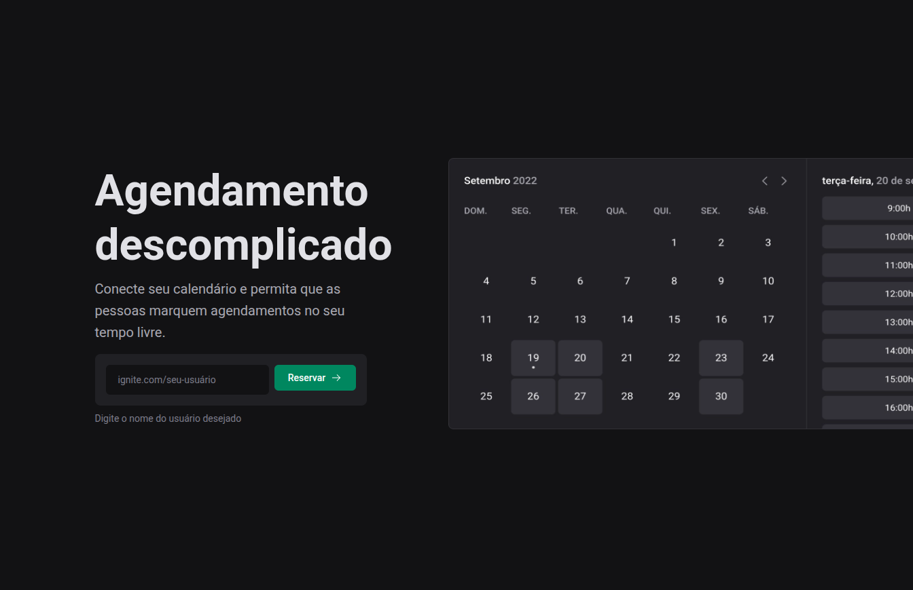

1|

     2|  
     3|

     4|
     5|# ⏰ Ignite Call
     6|
     7|

     8|  
     9|

    10|
    11|
    12|

    13|
    14|A modern scheduling system built with Next.js and TypeScript, featuring Google Calendar integration, Google Meet automation, and advanced scheduling capabilities.
    15|
    16|
    17|
    18|
    19|
    20|
    21|
    22|

    23|
    24|
    25|
    26|**🌐 [Live Demo](https://ignitecall-app.vercel.app)** • **📸 [Screenshots](#-screenshots)**
    27|
    28|---
    29|
    30|

    31|  
    32|

    33|
    34|
    35|## 📖 Table of Contents
    36|
    37|| [Features](#-features) | [Tech Stack](#-tech-stack) | [Development Tools](#-development-tools) |
    38||----------------------|---------------------------|------------------------------------------|
    39|| [Prerequisites](#-prerequisites) | [Setup](#️-setup) | [Environment Variables](#-environment-variables) |
    40|| [Project Structure](#️-project-structure) | [Docker Setup](#-docker-setup) | [Contributing](#-contributing) |
    41|
    42|---
    43|

    44|
    45|## 📸 Screenshots
    46|
    47|
    48|
    49|| Scheduling | Calendar | Profile |
    50||:---:|:---:|:---:|
    51|